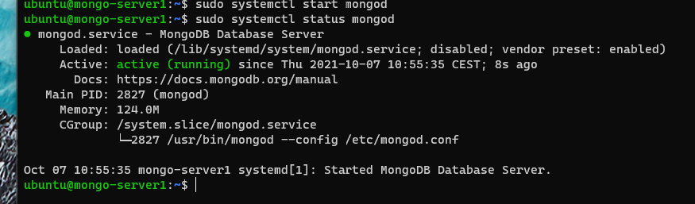

# How to install/deploy multiple MongoDb instances and configure a replica set

MongoDb is a popular NoSql database. We will be installing a few instances into some virtual machines and configure them to so as to have one primary database and a few secondary ones. For MongoDb it is recommended to always have (at least in production) multiple instances of the database engine running, so that machine failures can be automatically recovered from.

## Steps

- we will deploy three Ubuntu VMs using Multipass
- we will install a MongoDb to each VM
- we will change config files of each MongoDb instance
- we will start the instances
- we will use the Mongo shell to connect to the first instance and initialize the replica set

### About Multipass

Multipass is a containers technology not unlike Docker. However, it is slim and needs no configuration. It uses VirtualBox as its hypervisor so you will need that installed. On Windows you can use Hyper-V for running Multipass's virtual machines.

> Note: a typical Ubuntu VM under Multipass would allocate around 1 GiB of system memory.

[Check out the official site for more info.](https://multipass.run/)

### On terminology and setup

MongoDb replication supports one database with read/write permissions called the primary, and many secondary database which will listen for updates published by the primary and apply the changes to their own state.

In order for the primary to know that it should publish data to other instances, a replica set membership must be configured on each instance. All the instances should be in at least one same replica set identified by a simple key.

Reliability is achieved by having instances check for each other's network status and by running elections for picking a new primary if the usual one is down. Missing secondaries are ignored. There is a priority mechanism which can be leveraged to impact the result of primary elections.

## Step 0: Install Multipass

Go to website above for instructions.

## Step 1: Deploy three Ubuntu VM's

>Tip: use four terminal windows or tabs.

```bash
multipass launch --name mongo-server1
multipass launch --name mongo-server2
multipass launch --name mongo-server3
```

## Step 2: Install MongoDb to each VM

Connect to the multipass instance.

```bash
multipass exec mongo-server1 -- bash
```

For each deployed VM, run the commands in this section.

You can get a built version of MongoDb from the Ubuntu package registry. You can also get the official MongoDb release which is often newer than the one from Ubuntu.

```bash
# Ubuntu package
sudo apt-get install mongodb


# Official release
# get the public key
wget -qO - https://www.mongodb.org/static/pgp/server-5.0.asc | sudo apt-key add -

# create a list file (check the version numbers!)
echo "deb [ arch=amd64,arm64 ] https://repo.mongodb.org/apt/ubuntu focal/mongodb-org/5.0 multiverse" | sudo tee /etc/apt/sources.list.d/mongodb-org-5.0.list

# update apt
sudo apt-get update

# install
sudo apt-get install -y mongodb-org
```

## Step 3: Configure MongoDb on each machine

Use another terminal window on the host machine for reference.

```bash
#run to see virtual machine info
multipass list
```

While connected to the Multipass instance. Sudo open the config file with your favorite editor.

```bash
/etc/mongod.conf
```

You will see a simple file with not much data, organized clearly.
We only need to change two values here.

First we have to add another IP address to the list of network interfaces on which MongoDb will listen. By default it only listens on the loopback interface.

```yaml
# should be like this
net:
  port: 27017
  bindIp: 127.0.0.1, mongo-server1
```

Next, you will uncomment the replication section, and add another key value pair.

```yaml
replication:
  replSetName: yourReplicaSet
```

Save the changes and do this for each of the virtual machines. Vary the hostname used to configure the bound network interface.

## Step 4: Start the instances

For each VM run the usual systemctl commands to start the background mongod services.

```bash
# start the daemon
sudo systemctl start mongod

# verify it runs
sudo systemctl status mongod
```

Should look like this afterwards:



## Step 5: Connect to the primary database and initialize the replica set

Before proceeding debug any network problems between the running virtual machines and the host. The three machines should be pingable from each other using their hostnames. If so, you can continue. As it relates to host-VM networking and depending on your hypervisor, the running instances may have a DNS prefix to their hostname. Consult the dashboard/docs of your virtualization technology under a section similar to "networking".

MongoDb comes with a convenient shell for performing configuration tasks and limited data manipulation. It's something of a hybrid between a shell and a scripting environment together with an interpreter and it's a refreshing experience to use it. It does have some quirks, though, so don't overrely on it. It is still a database so be vary of possible data loss if not careful. 

```bash
# if connected to the machine running the would-be primary database
# connect to instance running locally on the default port
mongosh

# tip: connect to remote computer with instance listening on default port
mongosh mongo-server2
```

Initialize the replica set specifying the overall configuration of the system. Again, it is important to run this on the primary replica. Type:

```bash
rs.initiate({
  _id: : "yourReplicaSet",
  members : [
    { _id: 0, host: "mongo-server1:27017", priority: 2 },
    { _id: 1, host: "mongo-server2:27017" },
    { _id: 2, host: "mongo-server3:27017" },
  ]
})

# alternatively, specify only the 0-th member in the command above
# then use:
rs.add({ host: "mongo-server2:27017" })
```

You have now configured the primary instance with all needed info to support the replica set. As is the case in similar situations, some default values are implied.

```bash
# inspect the full replica set configuration
rs.conf()

# check that the instance has recognized itself as the primary
rs.status()
```

## Your have deployed a MongoDb replica set